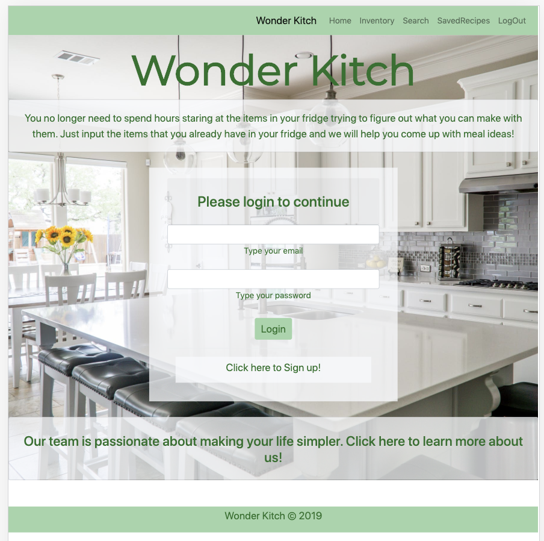
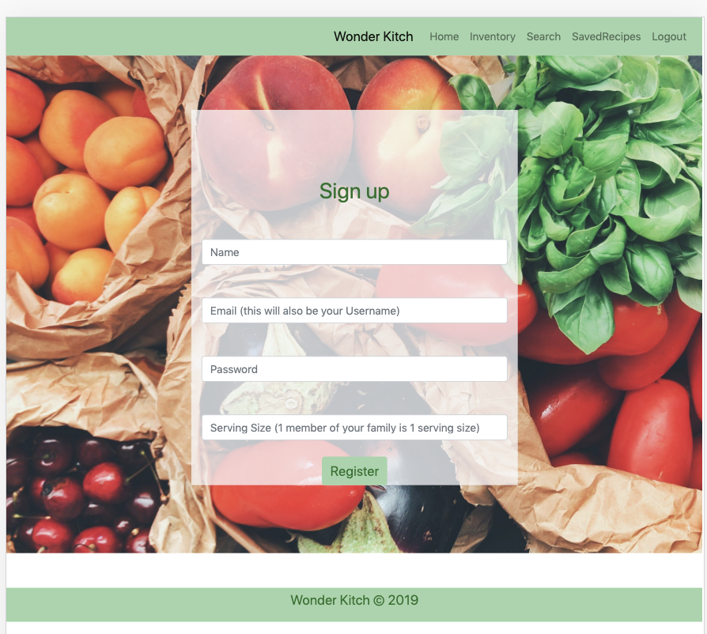
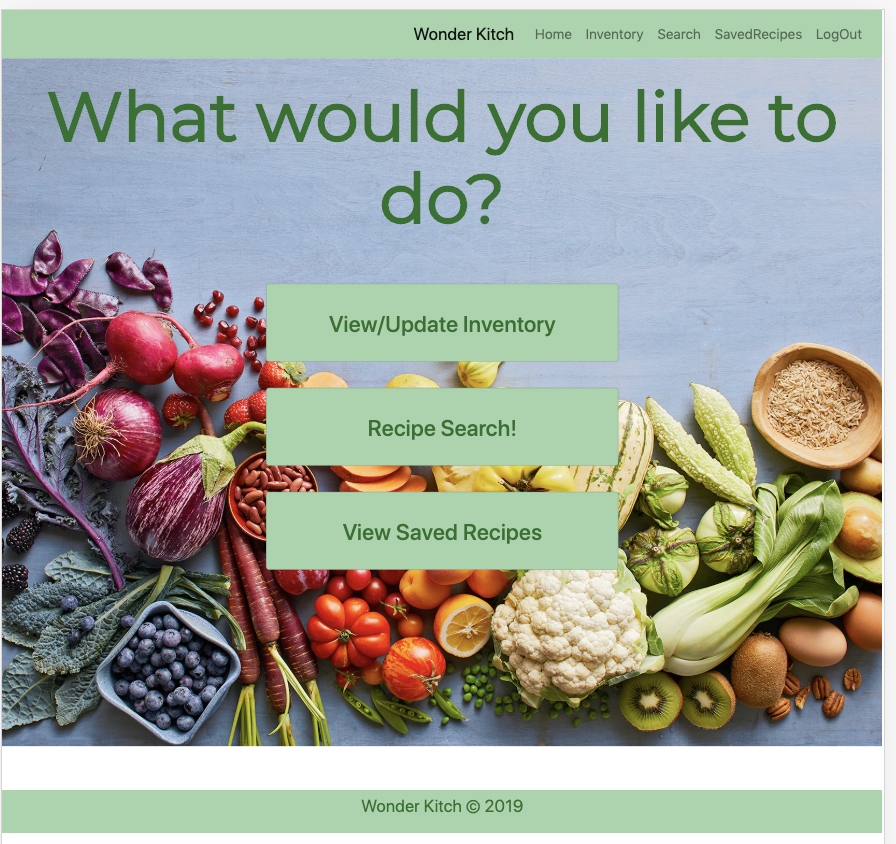
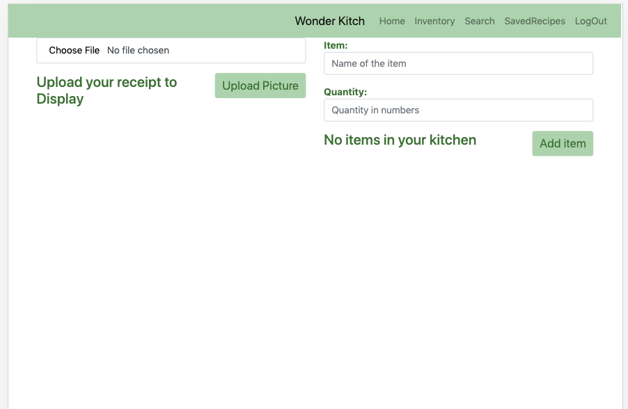
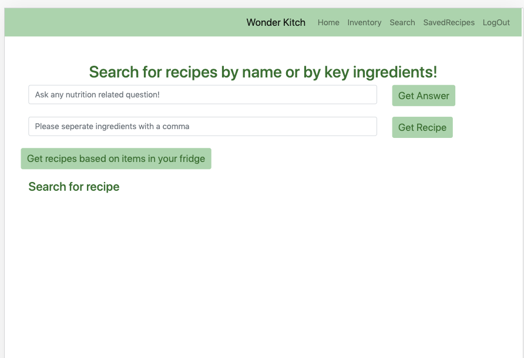
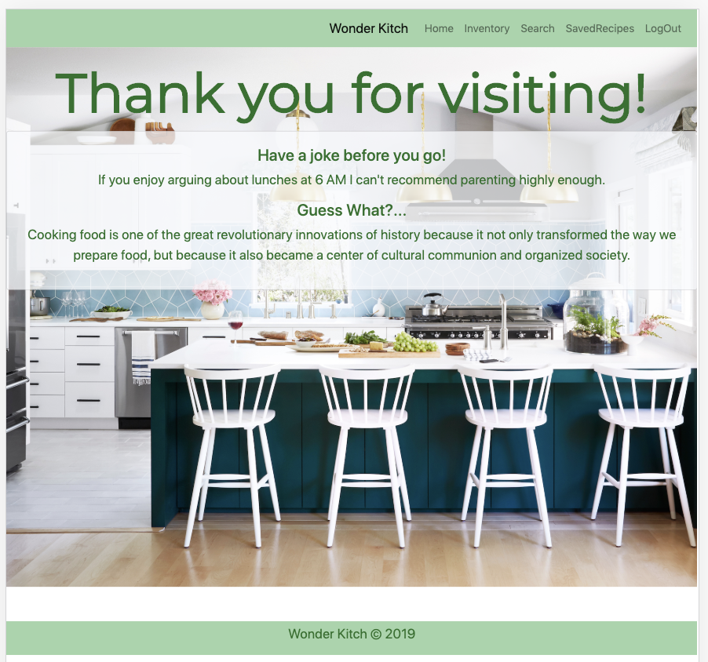

# Welcome to WonderKitch 

Overview:
WonderKitch is a Website designed to make meal planning efficient, easy and waste free. Users can view recipes that they can make based on foods that they already have in their fridge. 

# Technologies Used:
 * APIs:
    * Spoonacular 
    * Taggun
    
* Programming Language:
    * Javascript

* Libraries Used
    * React
    * Node 
    * JSON

* NPM Depndencies within Node
    * .gitignore
    * dotenv
    * axios
    * fs

# Instructions:
Wonderkitch is mobile friendly and easy to use! It does require user authentication, so users will need to make an account when they first enter the site. 

* 1)Users enter the homepage and can either login or create an account.
Login

Create Account

They can also click on the "learn more about us" link to view the information about the team that built this site

* 2)Once they are logged into WonderKitch they are directed to "view/update inventory" or "recipe search" 

* 3)View/Update inventory will lead them to a page where they can scan or upload their grocery receipt or manually upload items. The receipt scan feature will scan any grocery reciept and pull only the food items.
 

* 4)The Search page allows users to ask any nutrition related question, get a recipe based on key ingredients or simply view recipes based on ingredients that they have in their inventory. 

* 5) There is also the option to view saved recipes. Users can click this in the navbar and view recipes that they have previously saved. They can view or delete these recipes. 

* 6) Finally users can click the logOut button to log out of their account. This will lead the to the logOut page that displays  both a nutition fact and a joke.

## Link to deployed site:
(https://wonderktich.herokuapp.com) 
